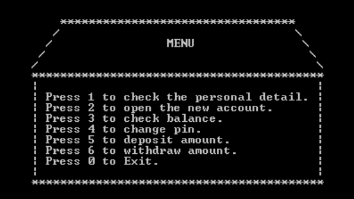
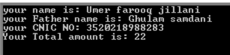
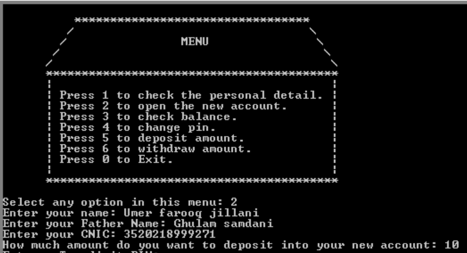
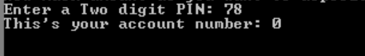
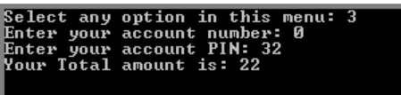
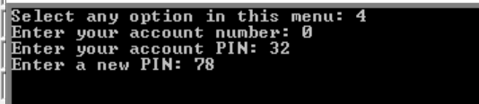
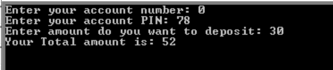
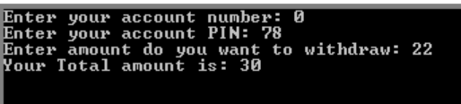
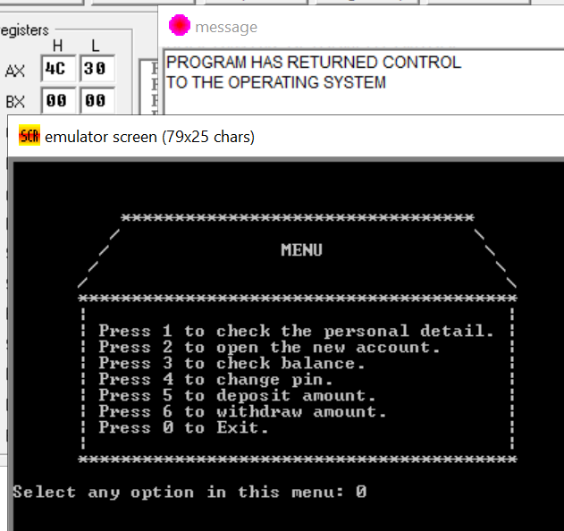

# 
📌 Bank Management System (Assembly - EMU8086)

## 📖 Project Overview  
The **Bank Management System** is an **Assembly Language (x86) application** developed using **EMU8086 - MICROPROCESSOR EMULATOR**. It allows users to perform banking operations such as:
- Personal detail
- account open
- check balance
- change pin
- deposit amount 
- withdraw amount

It is implemented using **Assembly (8086)** instructions and works with **low-level memory management**.

## 📋 Requirements
Here is a bank (…….) and a number of customers here which are avail different 
services of bank like :
1. Personal detail
2. account open
3. check balance
4. change pin
5. deposit amount 
6. withdraw amount

User can select anyone option in this menu, according these options your you can 
design proper detail of user. They can select any option in menu. Use commands 
**Mov, al, print, main endp, .code add and subtract**. 
- Like they get option 1 they see their proper detail in different line.
- If select option 2 then show open account option and ask for the necessary 
required details like name cnic and store them in an array.
- If they check their balance, then your system shows his/her account number 
and balance detail. 
- If they choose option 4, then your system shows his/her account pin change 
option. 

## 🚀 Features  
✅ **Account Creation & Personal Details Storage**  
✅ **Balance Checking**  
✅ **PIN Management (Set, Verify, Change)**  
✅ **Deposit & Withdraw Money**  
✅ **Menu-Driven Command-Line Interface**  

## 🏗️ Data Structures Used  
- **Arrays & Buffers:** Store user details, balance, and PINs.  
- **Procedures & Subroutines:** Modular design for efficient execution.  
- **Registers & Stack:** Used for temporary storage and function calls.  

## 🛠️ Tools & Technologies  
- **Language:** Assembly (8086)  
- **Assembler:** EMU8086 - MICROPROCESSOR EMULATOR  
- **Platform:** Windows  

## 📸 Screenshots

User-Friendly Menu

 

If the user enter the wrong input, then

 

If the user press 1 to check the personal details, then

 

If the user press 2 to open the new account, then

 
 

 

If the user press 3 to check the balance, then

 

If the user press 4 to change their PIN, then

 

If the user press 5 to deposit amount, then

  

If the user press 6 to withdraw amount, then

 

Press 0 to terminate

## 📌 Author
🔗 GitHub: [Umer Farooq Jillani](https://github.com/UmerFarooqJillani)  

---
